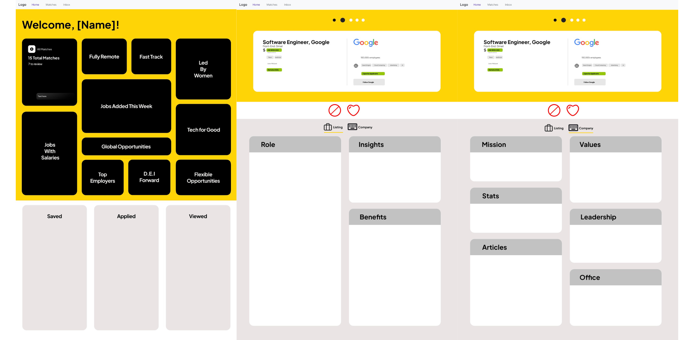

# Prospera | Final Project
### Ivan Reyes | ACS 1920 | Adam Braus

---

### Wireframe

---

### ℹ️ Program Description
**Prospera** is a personalized job search platform inspired by Tinder's swipe feature, designed to help you find your ideal career path. When you first sign up, you'll answer a series of questions about your professional background, career goals, education, years of experience, preferred industries, workplace values, hard and soft skills, and more. Based on your answers, Prospera matches you with jobs tailored to your profile. You can then 'match' with positions you're interested in or 'skip' those you're not, just like swiping on Tinder. It's a streamlined and interactive way to discover career opportunities that align with your goals.

*This program is heavily inspired by [Welcome to the Jungle](https://www.welcometothejungle.com/en).*

**Key features:**
*   **Bootstrap Feature:** Built with Bootstrap components, with additional custom CSS.
*   **Interactive Elements:** Dynamic components like modals, tooltips, and accordions for an engaging user experience.
*   **User-Friendly Navigation:** A clear and intuitive navbar.
*   **Three Pages:**
    *   **Home:**  View personalized job search progress, explore job categories, see live job listings, and access career advice.
    *   **Matches:**  Explore detailed information about curated job matches, including company details and insights.
    *   **Inbox:**  Connect with potential employers through direct messaging and manage communication.

---

### 🔐 Key Bootstrap Components Implemented
*   **Navbar:**  Sticky top navbar for easy navigation.
*   **Grid System:**  Used to create responsive layouts, especially on the home page for job categories.
*   **Cards:**  Display job category summaries and company information on the Matches page.
*   **Modals:** Provide detailed information about job categories on the home page.
*   **Accordions:** Organize job activity information (saved, applied, viewed jobs) on the home page.
*   **Tooltips:** Offer additional context on navigation links in the navbar.

---

### 💻 Technologies Used
*   **HTML5**
*   **CSS**
*   **Bootstrap 5**
*   **JavaScript**
*   **Font Awesome (for icons)**
*   **Bootstrap Icons**
*   **Leaflet.js (for the interactive map)**

---

### 📁 Project Structure 
*   `index.html`: Home Page
*   `matches.html`: Matches Page
*   `inbox.html`: Inbox Page
*   `index.css`, `matches.css`, and `inbox.css`: Custom CSS Files

---

### 🚀 Live Link
[Check out the live version here](https://prospera-o5lw.onrender.com)

